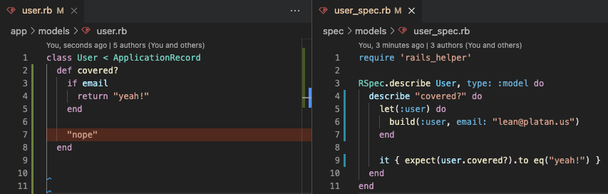
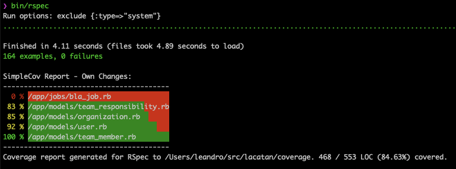

# SimpleCov Linter Formatter

[](https://badge.fury.io/rb/simplecov_linter_formatter)
[](https://app.circleci.com/pipelines/github/platanus/simplecov_linter_formatter)

Linter formatter for SimpleCov code coverage tool

***Note: To learn more about SimpleCov, check out the main repo at [https://github.com/simplecov-ruby/simplecov](https://github.com/colszowka/simplecov)***

This formatter has two features:

1) It generates a json file to feed the [VSCode SimpleCov plugin](https://github.com/anykeyh/simplecov-vscode).

   The plugin uses by default the json file produced by simplecov but, with this gem, we can filter the file to show code coverage related to our changes.

   
   
   

2) It shows a code coverage report on screen.

   

## Installation

- Install [reviewdog](https://github.com/reviewdog/reviewdog)

  ```bash
  brew install reviewdog/tap/reviewdog
  ```

  > You can avoid this step and `git status` will be used to filter results instead.

- Install [VSCode SimpleCov plugin](https://github.com/anykeyh/simplecov-vscode)

  You need to configure `SimpleCovLinterFormatter.json_filename = '.resultset.json'` to use the extension's default configuration.
  If you want yo keep the `.resultset.json` file intact you must change the plugin's "Path" option to point another file.

- Add to your Gemfile:

    ```ruby
    gem 'simplecov'
    gem 'simplecov_linter_formatter'
    ```

    ```bash
    bundle install
    ```

## Usage

Add the formatter to your `spec/spec_helper.rb`.

```ruby
require 'simplecov'
require 'simplecov_linter_formatter'

SimpleCovLinterFormatter.setup do |config|
  config.json_filename = '.resultset.json'
  config.scope = :all
end

SimpleCov.start 'rails' do
  # ...

  formatter SimpleCov::Formatter::MultiFormatter.new(
    [
      SimpleCov::Formatter::LinterFormatter,
      SimpleCov::Formatter::HTMLFormatter
    ]
  )
end
```

If you configure `SimpleCovLinterFormatter.scope = :own_changes` instead of `:all` you will see coverage warnings related to your changes only (it uses `git diff`).

### Summary Report

- Turn on the on screen report with option: `SimpleCovLinterFormatter.summary_enabled = true`
- Scope variation will affect the report:
  - `SimpleCovLinterFormatter.scope = :all`

    

  - `SimpleCovLinterFormatter.scope = :own_changes`

    

- Sort by `:alphabet` or, the default, `:coverage` option with `SimpleCovLinterFormatter.summary_files_sorting = :alphabet`

  

- Change the look of the report:
  - Turn off the background with `SimpleCovLinterFormatter.summary_enabled_bg = false`

    

  - Change colors:

    ```ruby
    SimpleCovLinterFormatter.setup do |config|
      config.summary_enabled_bg = true # you need enabled background
      config.summary_covered_bg_color = :lightblue
      config.summary_not_covered_bg_color = :pink
      config.summary_text_color = :black
    end
    ```

    


## Testing

To run the specs you need to execute, **in the root path of the gem**, the following command:

```bash
bundle exec guard
```

You need to put **all your tests** in the `/simplecov_linter_formatter/spec/` directory.

## Publishing

On master/main branch...

1. Change `VERSION` in `lib/simplecov_linter_formatter/version.rb`.
2. Change `Unreleased` title to current version in `CHANGELOG.md`.
3. Run `bundle install`.
4. Commit new release. For example: `Releasing v0.1.0`.
5. Create tag. For example: `git tag v0.1.0`.
6. Push tag. For example: `git push origin v0.1.0`.

## Contributing

1. Fork it
2. Create your feature branch (`git checkout -b my-new-feature`)
3. Commit your changes (`git commit -am 'Add some feature'`)
4. Push to the branch (`git push origin my-new-feature`)
5. Create new Pull Request

## Credits

Thank you [contributors](https://github.com/platanus/simplecov_linter_formatter/graphs/contributors)!


SimpleCov Linter Formatter is maintained by [platanus](http://platan.us).

## License

SimpleCov Linter Formatter is © 2021 platanus, spa. It is free software and may be redistributed under the terms specified in the LICENSE file.
